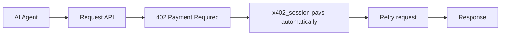

# x402-aa-wallet

**The easiest way for an ERC-4337 / account-abstraction agent to pay x402
API calls — with a dedicated, non-custodial EOA, since its smart-wallet
signature doesn't work with x402 yet.**

A lightweight, typed SDK: generate a spend wallet, fund it from your
agent's own smart wallet, and every request through it pays x402
(HTTP 402) challenges automatically — retried and returned, no manual
handling — against **any** x402 merchant.



## Features

- 🤖 Built for ERC-4337 / account-abstraction agents
- 💳 Automatic x402 payment handling — detect a 402, pay, retry, transparently
- 💰 Optional `max_amount_usd` (per-call) and `max_total_usd` (per-session) spend caps — real enforcement boundaries, not just docs warnings
- ✅ USDC asset verification always on — a merchant cannot get a signature for an arbitrary token contract
- 🔒 Non-custodial — the private key never leaves your process, and is excluded from `repr()` so `print(wallet)`/tracebacks won't show it (note: `vars()`/`dataclasses.asdict()` still would — see below)
- ⚡ Minimal dependencies (`eth-account`, `requests`, `x402`)
- 🌐 Works against any x402-compatible API
- 📦 Fully typed
- 🟦 TypeScript implementation also available (see Related projects)

## Installation

```bash
pip install x402-aa-wallet
```

## Quick start

```python
from x402_aa_wallet import create_spend_wallet, get_usdc_balance, x402_session

// 1. Generate a dedicated spend wallet — locally, once.
wallet = create_spend_wallet()
print("fund this address:", wallet.address)
# store wallet.private_key yourself (env var / secret manager) — this
# library never sees it again after this call returns.

# 2. Fund `wallet.address` with a little USDC on Base — from your agent's
#    own smart wallet, using its own transfer/send call (not this library).

# 3. Check the balance whenever you want to know if it needs topping up.
balance = get_usdc_balance(wallet.address)

# 4. Pay any x402 endpoint with it — payment happens automatically.
#    max_amount_usd is optional but strongly recommended for autonomous
#    use: it refuses to pay any single challenge above this amount
#    instead of trusting whatever the server's 402 response asks for.
session = x402_session(wallet, max_amount_usd=0.5)

# Call any x402-protected endpoint — payment happens automatically.
resp = session.get("https://api.example.com/data")
print(resp.json())
```

Restarting your agent? Rehydrate the same wallet from the key you stored:

```python
from x402_aa_wallet import spend_wallet_from_private_key

wallet = spend_wallet_from_private_key(YOUR_STORED_PRIVATE_KEY)
```

## Why this exists

x402's "exact" EVM scheme settles payment via an EIP-3009 ECDSA signature,
which an account-abstraction owner key (often a P256/WebAuthn passkey, or
even secp256k1 but the wrong address) usually can't produce — full
ERC-1271/ERC-6492 smart-wallet support is still an open, unshipped
facilitator feature (see
[coinbase/x402#639](https://github.com/coinbase/x402/issues/639)). The fix
is giving the agent a small, dedicated EOA it funds itself, purely for
x402 spending.

## Non-custodial — read this before using it

**We never see your private key. Nobody does but you.**

- `create_spend_wallet()` generates a fresh secp256k1 keypair *entirely
  inside your own process*, using `eth_account`. Nothing is transmitted,
  logged, or persisted by this library.
- The private key is returned to you once, in memory. Store it yourself
  (env var, secret manager) — this library keeps no copy after the call
  returns.
- `SpendWallet` excludes `private_key` from its `repr()` — direct
  attribute access (`wallet.private_key`) still works, but
  `print(wallet)`, an unhandled exception's traceback, or a logging call
  that stringifies the object won't show it. **Know the limit:** `repr()`
  is the only protected vector. `vars(wallet)`,
  `dataclasses.asdict(wallet)`, and structured loggers/error reporters
  that serialize object attributes still see the key (Python has no
  dataclass equivalent of the TypeScript package's non-enumerable
  property), and `wallet.account.key` always holds the raw key bytes.
  Don't feed the wallet object to a dict-serializing sink — pass
  `wallet.address` around instead.
- Funding the spend wallet is **your** agent's job, using **your** agent's
  own smart-wallet infrastructure. This library never moves funds itself —
  it only tells you the address to send to and (via `get_usdc_balance`)
  how much is there.
- The published package is open source. Don't trust this description —
  read `src/x402_aa_wallet/`, it's short.

## Spend caps

`x402_session` accepts two independent caps:

```python
session = x402_session(
    wallet,
    max_amount_usd=0.10,  # per challenge
    max_total_usd=5.0,    # per session
)
```

Without a cap, `x402_session` pays whatever a 402 response asks for — a
misbehaving or compromised merchant returning a much larger amount than
expected gets paid in full, silently. With `max_amount_usd` set, a payment
requirement above the cap is filtered out before signing (via a real
`x402ClientSync` policy, not a client-side amount check bolted on after
the fact), and if that leaves nothing payable, the request raises instead
of proceeding.

`max_amount_usd` alone is per challenge: a merchant charging exactly at
the cap on every request still drains `cap × N` over N requests — which
is precisely how an autonomous retry loop gets bled. `max_total_usd`
closes that: once the payments this session has authorized reach the
budget, further challenges raise. Accounting is at authorization time and
deliberately conservative — a payment that later fails still consumes
budget (the signature already left the process). Build a new
`x402_session` to start a fresh budget.

The caps only evaluate a requirement whose asset is a known 6-decimal
Circle USDC deployment (Base mainnet or Base Sepolia) — anything else is
excluded rather than evaluated with a guessed decimal count, since
guessing wrong could make a genuinely large charge on a different-decimals
asset look small enough to slip through.

### Asset verification is always on

Since 0.3.0 the USDC allowlist applies even with **no** cap set: an
EIP-3009 authorization is valid for whatever token contract it names, so
signing for an arbitrary merchant-supplied asset could move ANY EIP-3009
token the EOA holds. A challenge on an unrecognized asset now raises by
default. If you genuinely want the old behavior, pass
`allow_unknown_assets=True` — it is honored only when no cap is set (an
asset with unverified decimals cannot be measured against a USD cap), and
only sensible when the wallet holds nothing you are not willing to lose.

## API

| Function | Returns |
| --- | --- |
| `create_spend_wallet()` | A new `SpendWallet(address, private_key, account)` |
| `spend_wallet_from_private_key(key)` | Rehydrates a `SpendWallet` from a key you already have |
| `get_usdc_balance(address, rpc_url=DEFAULT_BASE_RPC_URL)` | USDC balance (float, human units) on Base |
| `x402_session(wallet, *, max_amount_usd=None, max_total_usd=None, allow_unknown_assets=False, network=NETWORK)` | A `requests.Session` that auto-pays x402 challenges — `wallet` can be a `SpendWallet`, an `eth_account` `LocalAccount`, or a raw private key string. Caps and asset verification — see "Spend caps" above; `network` overrides the default `eip155:8453` (Base mainnet) |

`get_usdc_balance` talks to Base over plain JSON-RPC (`eth_call`) — no
`web3.py` dependency, one read-only call. Override `rpc_url` if you run
your own node.

## Use cases

- AI assistants and copilots
- MCP servers
- Autonomous agents built on ERC-4337 smart wallets
- Multi-agent systems
- Research agents
- Trading bots
- Automation workflows

## Payment safety

Every payment `x402_session` makes is real USDC on Base mainnet — not
reversible. Only fund the spend wallet with what you're willing to spend,
and never reuse an EOA that also holds funds you care about for anything
else. Set `max_amount_usd` (see "Spend cap" above) for any autonomous/agent
use — don't rely on funding discipline alone as the only safety boundary.

## Related projects

- [x402-aa-wallet (TypeScript)](https://www.npmjs.com/package/x402-aa-wallet) —
  TypeScript implementation of this package
- [x402](https://www.x402.org) — the HTTP 402 payment protocol

## Development

```bash
pip install -e ".[dev]"
pytest
```

## License

MIT
